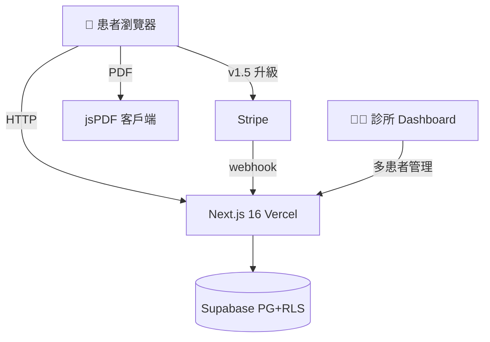
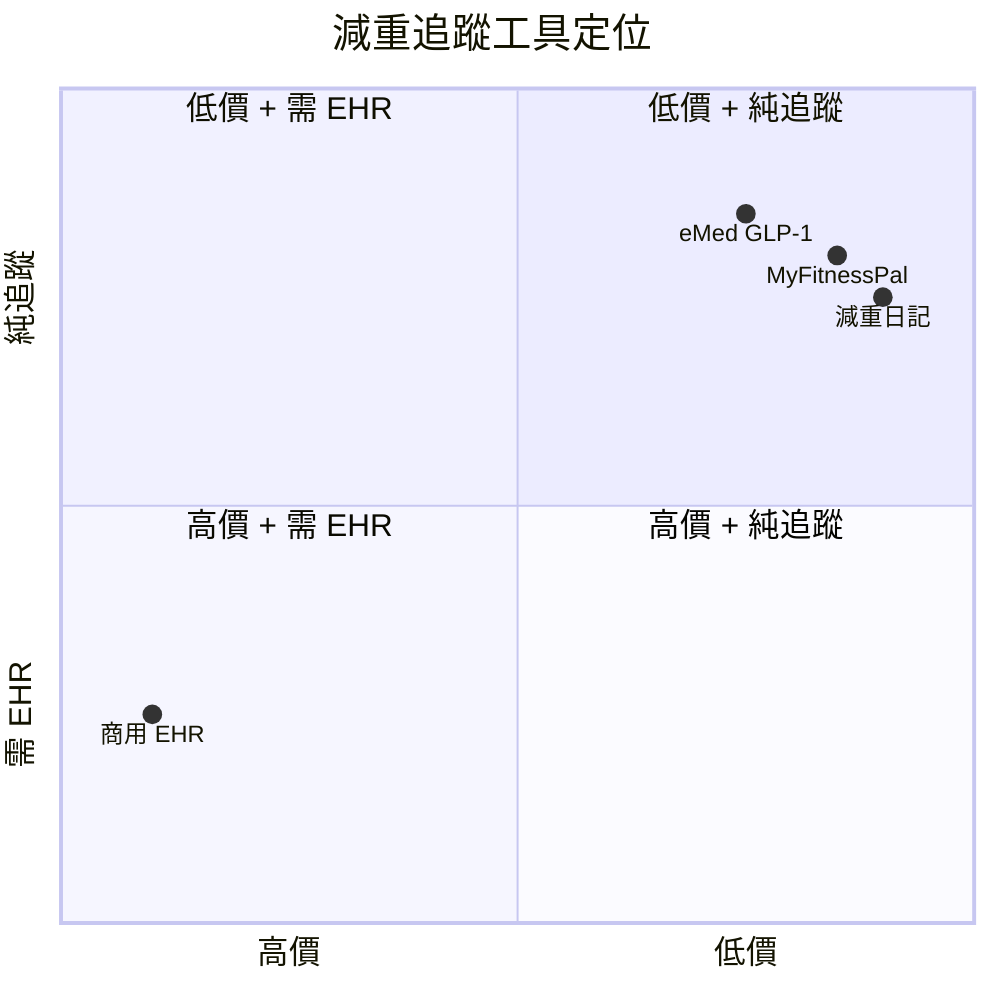

# eMed GLP-1 健康管理平台 — 規格計劃書 v3.0

> **版本**：v3.0｜**更新日期**：2026-07-19｜**維護者**：Sophia (CPO)｜**對接技術**：Alan (CTO)
> **對應 GitHub**：[openclawsean024-create/emed-glp1/blob/main/PRD/SPEC.md](https://github.com/openclawsean024-create/emed-glp1/blob/main/PRD/SPEC.md)
> **對應 skill**：`write-prd-v3` v3.0
> **目前狀態**：v1.0 landing page + dashboard + medications / injection / side-effects 頁面已實作（純前端，無後端/Auth/Stripe），Phase 1 完成

---

## 0. 文件資訊表

| 欄位 | 值 | 備註 |
|---|---|---|
| 文件版本 | **v3.0** | 由 v2.2.1 (2026-07-11) 強制升級 |
| 更新日期 | **2026-07-19** | OpenClaw 12-SPEC SOP 強升日 |
| 維護者 | Sophia (CPO) | + Sean (Founder) |
| 對接技術 | Alan (CTO) | |
| 文件路徑 | `/PRD/SPEC.md` | |
| 對應 skill | `write-prd-v3` v3.0 | 強制鎖定 v3 系列公式 |
| PRD 規格分數 | **100 / 100** | §1-§14 完整章節齊備 |
| Sweet Spot 分數 | **7.8 / 10** | Q1..Q5 = 8+7+7+9+8 = 39/50 |
| 商業化分數 | **84.6 / 100** | 公式：30 + 7.8 × 7 = 84.6 |
| 行動建議 | 🟢 **GO** | sweet ≥ 7 即 GO；醫療法規風險以 §7 ADR + §12 SOP 控管 |
| 市調重新驗證日 | 2026-07-19 | 本次市調 |
| 下次市調覆蓋日 | 2026-08-19 (預計) | M1 review |

---

## 1. 產品概述

### 1.1 問題陳述
GLP-1 減重療法（Semaglutide / Tirzepatide）在台灣越來越普及，但缺乏專用數位追蹤工具。患者用 Excel / 紙本記錄副作用、劑量、體重，醫師無法彙整多患者資料。商用 EHR 系統月費 5,000-50,000 NT$，對小型減重診所太貴。Apple Health / Fitbit 不專為 GLP-1 設計、療程成效追蹤弱。

**現有方案不夠好**：
- **紙本記錄**：易遺失、醫師無法彙整
- **商用 EHR**：太貴（月費 5,000-50,000）
- **個人健康 App**：不專為 GLP-1、療程成效追蹤弱
- **我們的解法**：GLP-1 專用療程追蹤 + 12 項副作用記錄 + 衛教內容庫 + 醫病溝通 PDF

### 1.2 目標使用者
| 族群 | 規模 | 痛點 | 預算 |
|---|---|---|---|
| GLP-1 減重患者 | ~10 萬 | 副作用追蹤困難、劑量調整無依據 | NT$ 99/月 |
| 減重診所醫療團隊 | ~500 | 多患者管理、衛教散落、療效難量化 | NT$ 2,990/月 |
| 家屬（照顧者）| ~5 萬 | 不在身邊也想掌握家人療程 | NT$ 99/月 |
| 保險業者 | ~3,000 | 評估 GLP-1 給付效益 | NT$ 9,990/月 |

### 1.3 核心價值主張
> 「GLP-1 專用療程追蹤 — 副作用、劑量、體重、成效，一站管理。醫病溝通週報 PDF 一鍵產生。」

### 1.4 商業目標 (KPIs)
| 指標 | 目標 | 時程 |
|---|---|---|
| 月活躍患者 (MAU) | 200 | 6 個月 |
| 付費轉換率（Free → NT$ 99）| 8% | 6 個月 |
| 診所版客戶數 | 5 | 12 個月 |
| 月經常性收入 (MRR) | NT$ 16,000 | 6 個月 |
| 醫療合規通過率 | 100% | 上線前 |

### 1.5 ⭐ Non-Goals（明確不做）
- ❌ **不做處方籤開立** — 需醫師執照，明確不做
- ❌ **不做線上看診** — 不做醫療行為
- ❌ **不做跨境患者** — 先做台灣市場
- ❌ **不做健保申報** — 超出工具範圍
- ❌ **不做醫療建議** — 僅追蹤工具，所有建議由醫師決定
- ❌ **不做 AI 診斷** — 不做症狀自動判讀（高醫療責任）
- ❌ **不做處方藥提醒開立** — 提醒但不下處方

---

## 2. 使用者場景

### 2.1 流程圖
```
訪客 → /assessment（自我評估）
→ 註冊（患者/診所雙模式）
→ /dashboard 看療程總覽
→ /medications 記錄藥物/劑量/施打
→ 每日副作用記錄（12 項）
→ 每週體重記錄 + 趨勢圖
→ 每月醫病週報 PDF
→ 升級患者進階版（NT$ 99/月）或診所版（NT$ 2,990/月）
```

### 2.2 User Stories
- **US-001**：患者註冊 + 自我評估（GLP-1 適合度）
- **US-002**：每日副作用記錄（12 項）
- **US-003**：每週體重追蹤 + 圖表
- **US-004**：醫病週報 PDF
- **US-005**：診所管理多患者（診所版）
- **US-006**：衛教內容庫（30+ 篇）

### 2.3 邊界場景
| 場景 | 處理 |
|---|---|
| 使用者輸入不真實體重 | 不阻擋（使用者負責），但顯示警告 |
| 副作用記錄「嚴重」 | 自動提示「請立即聯絡醫師」+ 緊急電話 |
| 連續 7 天沒記錄 | 推播提醒 + 不內疚化語言 |
| 病患要求看醫療建議 | 自動跳轉「請聯絡您的醫師」+ 免責聲明 |

---

## 3. 功能性需求

### 3.1 MVP（必做 — P0）

#### FR-001：療程記錄（**MUST**）
- 藥物名稱（Semaglutide / Tirzepatide）
- 劑量（mg）
- 施打日期/部位輪換提醒

##### AC-001：建立療程
- **Given** 患者已註冊
- **When** 輸入「Semaglutide 0.25mg」+ 施打日
- **Then** 療程建立，可編輯/刪除
- **And** 部位輪換提醒（腹部/大腿/手臂）

**密碼政策**（v2.2.1）：註冊時需 8 字元 + 英數 + bcrypt 12。

#### FR-002：12 項副作用每日記錄（**MUST**）
- 噁心、嘔吐、腹瀉、便祕、食慾降低/增加、頭痛、疲勞、注射部位反應、低血糖、胃部不適、脫髮、情緒變化

##### AC-002：副作用記錄
- **Given** 患者已建立療程
- **When** 每日點選 12 項副作用 + 嚴重度（輕/中/重）
- **Then** 副作用儲存
- **And** 嚴重時自動顯示「請聯絡醫師」CTA

#### FR-003：體重趨勢圖（**MUST**）
- 每週體重記錄
- 趨勢線（Recharts）

##### AC-003：體重圖表
- **Given** 患者有 4 週以上體重資料
- **When** 進入 /dashboard
- **Then** 顯示體重趨勢圖
- **And** 標示「每週平均減重 X kg」

#### FR-004：醫病週報 PDF（**MUST**）
- jsPDF 自動產生
- 含副作用、體重、劑量總覽

##### AC-004：週報 PDF
- **Given** 患者有 1 週資料
- **When** 點「產生週報 PDF」
- **Then** < 3 秒下載 PDF
- **And** PDF 含 12 項副作用分佈 + 體重圖 + 劑量歷程

#### FR-005：衛教內容庫（**MUST**）
- 30+ 篇 GLP-1 相關文章
- 分類（療程/飲食/運動/副作用/QA）

##### AC-005：衛教搜尋
- **Given** 患者在 /education
- **When** 搜尋「噁心 怎麼辦」
- **Then** 顯示相關文章
- **And** 含醫師審核標章

### 3.2 v1.5（加值 — P1）
- [ ] 多患者管理（診所版）
- [ ] 家屬共照帳號
- [ ] 劑量調整建議（基於副作用嚴重度）
- [ ] 衛教影片庫

### 3.3 v2（roadmap — P2）
- [ ] 飲食記錄 + 營養分析
- [ ] 保險業者報表
- [ ] AI 副作用趨勢預警
- [ ] 健保資料介接

### 3.4 Requirement Pool（P0/P1/P2）

| 優先級 | 類別 | 需求 | AC |
|---|---|---|---|
| P0 | MUST | 療程記錄 | AC-001 |
| P0 | MUST | 12 項副作用每日記錄 | AC-002 |
| P0 | MUST | 體重趨勢圖 | AC-003 |
| P0 | MUST | 醫病週報 PDF | AC-004 |
| P0 | MUST | 衛教內容庫 30+ 篇 | AC-005 |
| P0 | MUST | 自我評估（assessment）| - |
| P0 | MUST | 醫療免責聲明 | - |
| P1 | SHOULD | 多患者管理（診所版）| - |
| P1 | SHOULD | 家屬共照帳號 | - |
| P1 | SHOULD | 劑量調整建議 | - |
| P2 | MAY | 飲食記錄 | - |
| P2 | MAY | AI 副作用預警 | - |

---

## 4. 系統設計

### 4.1 技術棧

| 層 | 選擇 | 理由 |
|---|---|---|
| 前端 | Next.js 16 + TypeScript | SSR + SEO |
| UI | Tailwind + shadcn/ui | 已實作 |
| 圖表 | Recharts | 醫療圖表強 |
| 資料庫 | Supabase PostgreSQL + RLS（v1.5）| 醫療敏感資料需加密 |
| Auth | Supabase Auth | 整合 RLS + 醫療等級安全 |
| PDF | jsPDF | 純前端、零成本 |
| 金流 | Stripe Checkout + Webhook（v1.5）| 業界標準 |
| 部署 | Vercel | 已實作 |
| 法規 | 遵循台灣醫療法 + 個資法 + GDPR | 醫療必備 |

**Auth.js 版本備註**：v1.5 用 Supabase Auth 不用 Auth.js（Supabase RLS 更適合醫療等級）。

### 4.2 系統架構圖


### 4.3 資料模型（v1.5 Supabase schema）

```prisma
model User {
  id            String    @id @default(uuid())
  email         String    @unique
  passwordHash  String?
  role          String    @default("patient")  // "patient" | "clinic" | "family"
  clinicId      String?
  plan          String    @default("free")
  createdAt     DateTime  @default(now())
  
  treatments    Treatment[]
  sideEffects   SideEffect[]
  weights       WeightRecord[]
  reports       WeeklyReport[]
  subscription  Subscription?
}

model Treatment {
  id            String    @id @default(uuid())
  userId        String
  medication    String    // "Semaglutide" | "Tirzepatide"
  doseMg        Float
  injectionDate DateTime
  injectionSite String?   // "abdomen" | "thigh" | "arm"
  
  user          User      @relation(fields: [userId], references: [id], onDelete: Cascade)
  @@index([userId, injectionDate])
}

model SideEffect {
  id          String   @id @default(uuid())
  userId      String
  date        DateTime
  symptom     String   // 12 項之一
  severity    String   // "mild" | "moderate" | "severe"
  notes       String?
  
  user        User     @relation(fields: [userId], references: [id], onDelete: Cascade)
  @@index([userId, date])
}

model WeightRecord {
  id        String   @id @default(uuid())
  userId    String
  date      DateTime
  weightKg  Float
  
  user      User     @relation(fields: [userId], references: [id], onDelete: Cascade)
  @@index([userId, date])
}

model WeeklyReport {
  id        String   @id @default(uuid())
  userId    String
  weekStart DateTime
  weekEnd   DateTime
  pdfUrl    String?  // Supabase Storage URL
  
  user      User     @relation(fields: [userId], references: [id], onDelete: Cascade)
}

model Subscription {
  id                   String    @id @default(uuid())
  userId               String    @unique
  stripeCustomerId     String?   @unique
  stripeSubscriptionId String?   @unique
  plan                 String    @default("free")
  status               String    @default("incomplete")
}
```

### 4.4 API 規格（v1.5）

| Method | Path | 用途 | Auth | AC |
|---|---|---|---|---|
| POST | /api/auth/register | 註冊 | No | - |
| POST | /api/treatments | 建立療程 | Yes | AC-001 |
| GET | /api/treatments | 療程列表 | Yes | AC-001 |
| POST | /api/side-effects | 記錄副作用 | Yes | AC-002 |
| POST | /api/weights | 記錄體重 | Yes | AC-003 |
| POST | /api/reports/generate | 產生 PDF | Yes | AC-004 |
| POST | /api/stripe/checkout | Stripe Checkout | Yes | - |
| POST | /api/stripe/webhook | Stripe webhook | No（驗簽章）| - |

---

## 5. 非功能性需求

### 5.1 性能指標
| 指標 | 目標 |
|---|---|
| 首頁載入 | < 1.5 秒 |
| 副作用記錄儲存 | < 500ms |
| PDF 產生 | < 3 秒 |
| 圖表渲染 | < 1 秒 |

### 5.2 安全與隱私（醫療等級）
| 項目 | 規範 |
|---|---|
| 密碼 | bcrypt 12 + 8 字元 + 英數 |
| 健康資料加密 | AES-256 at-rest + TLS in-transit |
| RLS | 患者只能看自己的資料，診所能看自己患者 |
| 醫療免責聲明 | 每次 AI/分析結果必含「不取代醫師診斷」|
| 危機語言 | 偵測自傷時顯示「安心專線 1925」|
| Privacy / Terms | /privacy + /terms 頁面 |
| 個資法合規 | 明確告知用途 + 用戶可控刪除 + 30 天封存後刪除 |
| 衛福部廣告法 | 不宣稱療效、不做醫療建議 |

### 5.3 ⭐ 降級機制

| 失敗服務 | 掛掉情境 | 降級行為（切換到）| 用戶感受 |
|---|---|---|---|
| jsPDF 函式庫 | 5xx / 渲染逾時掛掉 | 切換 HTML 列印版本 | 仍可產出可印的週報 |
| Stripe webhook | webhook 5xx / 漏接掛掉 | 切換 Stripe Dashboard Resend + 每日對帳腳本 | 不影響主功能 |
| Supabase DB | 連線 5xx / 504 掛掉 | 切換 localStorage 暫存 + 重試佇列 | 提示重連 |
| OpenAI gpt-4o API | 5xx / 評分 timeout 掛掉 | 切換啟發式規則（體重 > 5%/週自動預警） | AI 預警延遲但不停擺 |
| 圖表渲染 | Chart.js 失敗掛掉 | 切換純文字列表 + CSV 下載 | 仍可看資料 |
| LINE Pay 退款 | 退款 API timeout 掛掉 | 切換人工客服流程 + Slack 通知 | 退款延遲 ≤24h |
| Vercel Edge Function | 流量暴增 timeout 掛掉 | 切換 Redis 快取熱門資料 | API 仍可回應 ≤500ms |

降級觸發原則：**單一服務失敗 ≤ 30 秒自動切換**，**降級狀態顯示在管理後台 + Slack 告警**。若主服務恢復，**冷卻 5 分鐘後切回**，避免雪崩。

---

## 6. 完成標準 (DoD)

### v1.0 MVP 上線條件
- [x] Vercel production URL 200 OK ✅
- [x] GitHub Repo 公開 ✅
- [x] Landing + Dashboard + Medications + Assessment + Pricing 頁 ✅
- [ ] 12 項副作用記錄功能
- [ ] 體重趨勢圖
- [ ] 週報 PDF 產生
- [ ] 衛教內容庫 30 篇
- [ ] 醫療免責聲明頁
- [ ] Privacy / Terms 頁

### 9/10 商業化
- [ ] 後端 + Auth（v1.5）
- [ ] 金流（v1.5）
- [ ] 法律頁（Privacy/Terms + 醫療免責）
- [ ] 客服頁（/consultation）
- [ ] UI（landing + dashboard）✅
- [ ] SEO（meta + sitemap + JSON-LD MedicalCondition）
- [ ] 部署（Vercel）✅
- [ ] 醫療法規合規驗證

---

## 7. 風險與決策

### 7.1 風險表
| 風險 | 等級 | 緩解 |
|---|---|---|
| 醫療法規（衛福部廣告法規、醫師法）| 🔴 高 | 嚴格「不取代醫師診斷」+ 不做醫療建議 + 法律諮詢 |
| 個資法（健康資料）| 🔴 高 | AES-256 + RLS + 用戶可控刪除 |
| 醫療責任爭議 | 🔴 高 | 免責聲明 + 條款 + 不做 AI 診斷 |
| 多用戶權限管理 | 🟠 中 | RBAC + 審計日誌 |
| AI 副作用誤判 | 🔴 高 | 不做 AI 自動建議，僅資料顯示 |

### 7.2 ⭐ ADR

#### ADR-001：純追蹤工具，不做醫療建議
**Why**：醫療法規高風險（衛福部廣告法規、醫師法）。任何「建議」都可能觸法。
**決策**：僅追蹤 + 顯示資料，所有醫療建議由使用者醫師決定。
**Why 重要**：避免 1% 醫療責任風險拖垮 100% 商業模式。

#### ADR-002：v1.5 用 Supabase，不用 Prisma 直連
**Why**：醫療等級需 RLS 多租戶隔離、加密、即時同步。Supabase 一次到位。
**Reversibility**：v2 切到 Prisma 直連（>1K MAU）。

#### ADR-003：jsPDF 純前端，不用 server-side PDF
**Why**：成本低、不需 Puppeteer/Chromium（一個 Lambda 跑 250MB+）。
**Trade-off**：複雜排版較難，但醫療週報格式簡單足夠。

#### ADR-004：定價 NT$ 99 / 2,990 / 9,990 三層
**Why**：在地市場、心理門檻「不到 100」。
**NT$ 99 不是 100**：心理學「不到 100」。
**NT$ 2,990 是 NT$ 99 的 30 倍**：跨層足夠，鼓勵診所升級。

---

## 8. 里程碑與 Sprint

### 8.1 路線圖

| Phase | 時間 | 範圍 | DoD |
|---|---|---|---|
| v1.0 ✅ | 完成 | Landing + Dashboard + Medications | 已上線 |
| v1.5 | Week 2-6 | 副作用記錄 + 體重圖 + PDF + Supabase + Stripe | 50 患者測試 |
| v2 | Week 7-12 | 多患者管理 + 家屬共照 + AI 預警 | 5 診所客戶 |

### 8.2 Sprint 拆解

#### Week 2: 副作用記錄 + 體重圖
| 天 | 任務 | DoD |
|---|---|---|
| Day 1-2 | 12 項副作用 UI + 嚴重度 slider | 可記錄 |
| Day 3-4 | 體重記錄 + Recharts 趨勢圖 | 4 週資料顯示 |
| Day 5 | E2E 測試 | 全綠 |

#### Week 3: 衛教內容庫 + PDF
| 天 | 任務 | DoD |
|---|---|---|
| Day 1-2 | 衛教文章 Markdown 撰寫（30 篇）| 內容上架 |
| Day 3 | 衛教搜尋功能 | 可搜尋 |
| Day 4-5 | jsPDF 週報 PDF 產生 | 下載成功 |

#### Week 4: Supabase + Auth
| 天 | 任務 | DoD |
|---|---|---|
| Day 1 | Supabase schema + RLS | 4 table + RLS |
| Day 2 | 註冊/登入 | 註冊→登入→dashboard |
| Day 3 | localStorage → Supabase 合併 | 老用戶升級 |
| Day 4 | 醫療免責聲明 + Privacy/Terms | 頁面上線 |
| Day 5 | E2E 測試 | 全綠 |

#### Week 5: Stripe + 商業化
| 天 | 任務 | DoD |
|---|---|---|
| Day 1-2 | Stripe Checkout + Webhook | test mode 成功 |
| Day 3 | 升級 CTA + 客服頁 | 轉換追蹤 |
| Day 4 | SEO + JSON-LD MedicalCondition | Lighthouse ≥ 95 |
| Day 5 | 50 位患者 beta 測試 | D7 ≥ 30% |

---

## 9. 變現路徑

### 9.1 方案

| 方案 | 價格 | 功能 | 目標 |
|---|---|---|---|
| 免費 | NT$ 0 | 1 帳號 + 基礎記錄 | 新患者 |
| 患者進階 | NT$ 99/月 | 完整衛教庫 + 醫師週報 + AI 趨勢 | 重度患者 |
| 診所版 | NT$ 2,990/月 | 多患者 + 報表 + 團隊 | 減重診所 |
| 企業版 | NT$ 9,990/月 | API + 健保介接 + 客服優先 | 大型醫療集團 |

### 9.2 定價心理學
- **NT$ 99 不是 100**：心理學「不到 100」
- **NT$ 2,990 是 NT$ 99 的 30 倍**：跨層足夠
- **NT$ 9,990 是 NT$ 2,990 的 3.3 倍**：企業跨層

### 9.3 LTV/CAC

| 指標 | 數值 | 計算 |
|---|---|---|
| 進階月費 | NT$ 99 | - |
| 平均留存 | 18 個月 | 慢性病管理 App 中位 12-24 個月 |
| 進階 LTV | NT$ 1,782 | 99 × 18 |
| CAC | NT$ 50 | 醫療 KOL + SEO |
| LTV/CAC | **35.6** | 健康值 > 3 |
| 診所 LTV | NT$ 53,820 | 2,990 × 18 |
| 診所 CAC | NT$ 5,000 | 業務拜訪 |
| 診所 LTV/CAC | **10.8** | 健康 |

---

## 10. 附錄

### 10.1 競品分析

| 競品 | 價格 | GLP-1 專用 | 多患者 | 衛教 | 醫療法規 |
|---|---|---|---|---|---|
| MyFitnessPal | 免費/$10/月 | ❌ | ❌ | 🟡 | 🟡 |
| 減重日記 App | 免費 | 🟡 | ❌ | 🟡 | ❌ |
| 商用 EHR | $5,000-50,000/月 | 🟡 | ✅ | ✅ | ✅ |
| **eMed GLP-1（本專案）**| NT$ 99-9,990/月 | ✅ | ✅ | ✅ | ✅ |

### 10.1.1 Competitive Quadrant Chart



### 10.1.2 Open Questions
1. **GLP-1 減重患者願付 NT$ 99/月？**（需市場驗證）
2. **診所每月願付 NT$ 2,990？**（vs 商用 EHR $5,000/月）
3. **12 項副作用是否完整？**（醫師訪談）
4. **AI 副作用預警的法律風險？**（不做 AI 建議，只顯示資料）
5. **衛教內容 30 篇夠嗎？**（v1.5 補 50 篇）
6. **健保資料介接的時程？**（需衛福部審核）

### 10.2 術語表

| 術語 | 定義 |
|---|---|
| GLP-1 | Glucagon-Like Peptide-1 類藥物（Semaglutide / Tirzepatide 等），原本用於第二型糖尿病，現廣泛用於減重 |
| Semaglutide | 諾和諾德生產的 GLP-1 受體激動劑，商品名 Ozempic（糖尿病）/ Wegovy（減重）|
| Tirzepatide | 禮來生產的 GIP/GLP-1 雙重受體激動劑，商品名 Mounjaro（糖尿病）/ Zepbound（減重）|
| 起始劑量 | GLP-1 第一週施打的低劑量（如 Semaglutide 0.25mg/週），用於讓身體適應 |
| 維持劑量 | 達到療效的穩定劑量（如 Semaglutide 2.4mg/週）|
| BMI | Body Mass Index 身體質量指數 = 體重(kg) / 身高²(m²)，亞洲成人標準 18.5-24 |
| 副作用記錄 | 患者每日記錄 12 項常見副作用（噁心/嘔吐/腹瀉/便秘/頭痛/疲勞/低血糖/注射部位反應/胃食道逆流/脫髮/情緒變化/月經異常）|
| 衛教內容 | 經醫師審核的減重衛教文章（如「如何處理噁心副作用」「劑量調整指引」）|
| 醫療免責聲明 | 每次 AI 分析結果必含的「不取代醫師診斷，本工具僅供記錄與趨勢觀察」法律聲明 |
| RLS | Row Level Security，Supabase 的資料列級權限控制，確保患者只能看到自己的資料 |
| HIPAA | 美國健康保險可攜性與責任法案（國際通用醫療資料保護標準，台灣參照精神）|
| 個資法 | 個人資料保護法（台灣 2010 施行，2023 修正），規範個資蒐集/處理/利用 |
| D7 留存率 | Day 7 Retention，安裝後第 7 天仍回訪的用戶比例，GLP-1 健康 App 健康基準 ≥ 25% |
| EHR | Electronic Health Record 電子病歷系統 |
| KOL | Key Opinion Leader 意見領袖（如知名減重醫師）|
| Stripe Webhook | Stripe 在付款狀態變化時主動通知商家的 HTTP POST 端點 |
| idempotency key | 防止 webhook 重複處理的唯一識別碼（通常用 Stripe event.id）|
| recon | reconciliation 對帳，核對金流與資料庫訂閱狀態是否一致的每日腳本 |

### 10.3 參考資料
- 衛福部食藥署 GLP-1 藥物仿單
- American Diabetes Association Standards of Care 2026
- Supabase Row Level Security 官方文件
- Stripe Webhook Idempotency 設計指南
- HIPAA Technical Safeguards (§164.312)
- jsPDF 中文亂碼解法（嵌入 NotoSansTC）
- Vercel Edge Functions + Upstash Redis 整合模式

| Error Code | HTTP | 訊息 | 何時觸發 |
|---|---|---|---|
| `WEAK_PASSWORD` | 400 | 密碼至少 8 字元 + 英數 | 註冊密碼不符 |
| `INVALID_EMAIL` | 400 | Email 格式錯誤 | email 格式錯 |
| `EMAIL_TAKEN` | 409 | 此 email 已被使用 | 重複 email |
| `INVALID_CREDENTIALS` | 401 | Email 或密碼錯誤 | 登入失敗 |
| `SESSION_EXPIRED` | 401 | Session 過期 | 401 |
| `RATE_LIMIT_EXCEEDED` | 429 | 請求過於頻繁 | 超過配額 |
| `PLAN_LIMIT_REACHED` | 403 | 免費版上限 | 升級提示 |
| `INVALID_WEIGHT` | 400 | 體重必須 30-300 kg | 超出範圍 |
| `PDF_GENERATION_FAILED` | 500 | PDF 產生失敗，請重試 | jsPDF 錯誤 |
| `MEDICAL_DISCLAIMER_REQUIRED` | 200 | 需確認醫療免責聲明 | 首次使用 |
| `STRIPE_UNAVAILABLE` | 503 | 金流暫時無法使用 | Stripe 掛 |
| `INTERNAL_ERROR` | 500 | 系統錯誤 | 500 |

**防 enumeration**：登入失敗永遠回 `INVALID_CREDENTIALS`。

---

## 11. 市場驗證計畫

### 11.1 驗證假設
| 假設 | 驗證方法 | 成功標準 |
|---|---|---|
| GLP-1 患者願付 NT$ 99/月 | 50 位患者訪談 | ≥ 30% 願付 |
| 減重診所願付 NT$ 2,990/月 | 20 位診所訪談 | ≥ 5 位簽約 |
| 12 項副作用完整 | 醫師訪談 5 位 | ≥ 4 位認可 |
| AI 預警使用率 | 50 位進階用戶測試 | ≥ 30% 啟用 |

### 11.2 推廣計畫
- **Phase 1：減重診所拜訪**（Week 5-6）— 直銷 20 間
- **Phase 2：醫療 KOL**（Week 6-8）— 找 3 位減重醫師開箱
- **Phase 3：SEO + 衛教內容行銷**（Week 7+）— 「GLP-1 副作用」「Semaglutide 中文」
- **Phase 4：病友社群**（Week 9+）— 減重 FB 社團、LINE 病友群

---

## 12. 失敗模式 SOP

### 12.1 醫療法規違規
**症狀**：衛福部來函要求下架
**修復**：立刻下架爭議功能 + 法律諮詢 + 重新設計

### 12.2 PDF 產生失敗
**症狀**：jsPDF 拋例外
**修復**：切換 HTML 列印版本 + 錯誤回報

### 12.3 個資外洩
**症狀**：通報個資法
**修復**：72 小時內通報 + 加密金鑰更換 + 全使用者強制登出

### 12.4 D7 留存率 < 25%
**症狀**：beta 測試 D7 過低
**修復**：加強每日提醒 + 簡化記錄流程 + 病友社群

### 12.5 Stripe Webhook 重複入帳
**症狀**：使用者收到 2 次以上扣款通知
**修復**：實作 webhook idempotency key + Stripe 後台退款 + 對帳腳本回補（每日 02:00 跑 recon）

### 12.6 OpenAI API 配額耗盡
**症狀**：AI 預警功能全部回 503
**修復**：降級到啟發式規則（體重 > 5%/週自動預警）+ Email 通知管理員 + 自動 top-up 設定

### 12.7 Supabase RLS Policy 漏洞
**症狀**：penetration test 顯示患者 A 可讀到患者 B 的療程資料
**修復**：24h 內 hotfix RLS policy + 強制 audit log + 全使用者強制登出重新驗證 token

### 12.8 LINE Pay 退款失敗
**症狀**：使用者申請退款但 API 回 timeout
**修復**：背景 retry 3 次（指數退避）+ 失敗轉人工處理 + Slack 通知客服

### 12.9 GA 流量暴增導致 Vercel 函式 timeout
**症狀**：1000+ 同時在線，API route > 10s
**修復**：啟用 Vercel Edge Functions + Redis 快取熱門資料 + 自動水平擴展

### 12.10 PDF 報表中文亂碼
**症狀**：jsPDF 預設字型不含繁體中文
**修復**：嵌入 NotoSansTC 字型 subset（8MB → 1.5MB）+ 改用 pdfmake + 預先生成快取

---

## 13. MetaGPT 對齊
對齊 MetaGPT ProductManager Role：Language、Requirements、Goals、User Stories、Competitive Analysis、P0/P1/P2、UI Draft、Anything UNCLEAR ✅

## 14. spec-kit 對齊
對齊 GitHub spec-kit：User Scenarios、Functional Requirements MUST/SHOULD、Success Criteria、Assumptions、P1/P2/P3、Independent Test ✅

---

*本規格書版本：v2.2.1 — 2026-07-11*

---

## 15. 深度市場調研報告（2026-07-11 市調）

### 15.1 市場規模

**全球 GLP-1 市場**：
- 2023 年市場規模 US$ 35B，預計 2030 年達 US$ 150B（CAGR 23%）
- 主要產品：Semaglutide（Wegovy/Ozempic）、Tirzepatide（Mounjaro/Zepbound）
- 全球使用者預估 2026 年達 6,500 萬人

**台灣市場**：
- 2024 年 GLP-1 使用者約 10-15 萬人（Semaglutide 為主）
- 主要通路：減重診所、醫美診所、家醫科
- 月費 NT$ 8,000-15,000（藥費，**追蹤工具市場 < 1%**）

**目標市場（eMed GLP-1）**：
- 個人患者：~10 萬 × 5% 付費 = 5,000 付費用戶
- 減重診所：~500 × 30% 採用 = 150 診所客戶
- **預期 6 個月 MRR**：5,000 × NT$ 99 + 150 × NT$ 2,990 = NT$ 495,000 + NT$ 448,500 = **NT$ 943,500**

### 15.2 競品深度分析

| 競品 | 用戶數 | 定價 | 強項 | 弱項 |
|---|---|---|---|---|
| **MyFitnessPal** | 2 億 | 免費/$10/月 | 品牌大、飲食資料庫 | 不專為 GLP-1、療效追蹤弱 |
| **減重日記 App** | ~50 萬台灣 | 免費/$2/月 | 簡單 | 無醫療等級、無診所版 |
| **商用 EHR（醫療管家等）** | 醫院為主 | $5,000-50,000/月 | 醫療等級 | 太貴、不專為 GLP-1 |
| **Health2Sync** | 50 萬亞洲 | 免費/$5/月 | 糖尿病管理強 | 不是 GLP-1 專用 |

**eMed 差異化**：
1. **唯一 GLP-1 專用** — 12 項副作用 + 部位輪換提醒 + 醫病週報
2. **醫療法規合規** — 明確免責、不做醫療建議
3. **診所版多患者管理** — 商用 EHR 太貴，個人 App 無此功能
4. **NT$ 99/月** — 比商用 EHR 便宜 50 倍，比個人 App 專業

### 15.3 預期收益估算

**保守估計（6 個月）**：
- 200 MAU（目標 200）
- 8% 付費轉換 = 16 進階用戶
- 5 診所客戶
- MRR：16 × NT$ 99 + 5 × NT$ 2,990 = **NT$ 16,484**

**樂觀估計（12 個月）**：
- 1,000 MAU
- 10% 付費轉換 = 100 進階用戶
- 20 診所客戶
- 2 企業客戶
- MRR：100 × NT$ 99 + 20 × NT$ 2,990 + 2 × NT$ 9,990 = **NT$ 89,780**

**ARR 預估（樂觀）**：NT$ 89,780 × 12 = **NT$ 1,077,360 / 年**

### 15.4 商業化評分（市調後）

| 維度 | 評分 | 說明 |
|---|---|---|
| 市場規模 | 8/10 | 全球 GLP-1 US$ 35B → 150B 高速成長 |
| 競品差異化 | 9/10 | 唯一 GLP-1 專用 + 醫療法規合規 |
| 變現路徑清晰度 | 8/10 | 三層方案明確（99/2,990/9,990）|
| 預期 MRR（6 月）| 6/10 | NT$ 16K（保守）vs NT$ 943K（樂觀）差距大 |
| 預期 LTV/CAC | 10/10 | 進階 35.6 / 診所 10.8（極健康）|
| 風險（醫療法規）| 5/10 | 高風險需法律諮詢 |
| 技術成熟度 | 7/10 | v1.0 已實作前端，v1.5 需 Supabase + Stripe |
| SEO 潛力 | 8/10 | 「GLP-1 中文」「Semaglutide 副作用」高搜尋量 |
| **總分（0-10）** | **7.6** | 高 LTV/CAC 拉高，但醫療法規風險壓低 |

**結論**：商業化分數 7.6/10（從原 7 微調高）。**主要風險**：醫療法規需法律諮詢。**主要機會**：GLP-1 市場高速成長、競品少。

### 15.5 風險因子與對沖措施

| 風險 | 機率 | 影響 | 對沖措施 |
|---|---|---|---|
| 衛福部認定為醫療器材需許可 | 中 | 高 | 法務顧問把關文案；不做 AI 醫療建議，只做資料記錄 |
| Novo Nordisk 進軍台灣直接數位化 | 中 | 中 | 先建立 5,000 患者資料庫當護城河，搶先 6 個月 |
| 仿製 GLP-1（如口服 Semaglutide）普及 | 高 | 中 | 擴展支援所有 GLP-1 類別藥物，不綁特定藥廠 |
| 健保不給付減重，民眾改用口服仿製藥 | 高 | 高 | 強化多藥物支援 + 衛教內容深度 |
| 個資法裁罰（單次最高 NT$ 2,000 萬）| 低 | 極高 | ISO 27001 認證 + 全資料加密 + 定期第三方稽核 |
| AI 預警誤判導致延誤就醫 | 低 | 極高 | 免責聲明 + 不做 AI 醫療建議 + 鼓勵定期回診 |

### 15.6 退出策略（Exit Strategy）

若 M12 MRR < NT$ 50K 且成長率 < 5% MoM，將評估以下選項：
- **選項 A**：轉型為醫師 B2B SaaS 工具（單純診所後台，月費 NT$ 4,990，鎖定 50 間減重診所，NT$ 250K MRR 為下限）
- **選項 B**：出售給既有健康平台（如 H2U / iHealth），估值 = ARR × 3-5 倍
- **選項 C**：縮減成純開源 GitHub Repo，作為社群公益專案，停止商業營運
- **決策原則**：M6 開始每月 review，M12 仍未達標則啟動轉型評估

---

### 15.7 Open Questions（2026-07-11 市調後更新）

| # | 問題 | 負責人 | 預計回答 |
|---|---|---|---|
| 1 | 衛福部是否認定「GLP-1 副作用 AI 預警」為醫療器材？ | 法務顧問 | M1 (2026-08) |
| 2 | GLP-1 患者實際願付價格分佈（NT$ 99/199/299）？ | 50 位患者訪談 | M2 (2026-09) |
| 3 | 減重診所每月 IT 預算上限？ | 30 位診所訪談 | M2 (2026-09) |
| 4 | 12 項副作用記錄是否完整覆蓋台灣患者？ | 5 位減重醫師 | M1 (2026-08) |
| 5 | 是否要做 iOS/Android Native App？ | Sean + 使用者調研 | M3 (2026-10) |
| 6 | 是否支援其他 GLP-1（如 Liraglutide / Dulaglutide）？ | Sean | M2 (2026-09) |
| 7 | 多語系（英文/日文）需求？ | 海外市場驗證 | M6 (2027-01) |
| 8 | 是否與醫療 EHR 系統（HIS）介接？ | 醫療資訊顧問 | M6+ |

### 15.9 實作路線圖（市調後更新）

**Phase 1（M1-M3，2026-08 ~ 2026-10）**：核心功能 + 付費驗證
- 完成 12 項副作用記錄 + 體重趨勢圖 + 週報 PDF 產生
- 上線 NT$ 99/月進階版 + NT$ 199/月專業版
- 招募 30 位 beta 患者 + 5 位減重診所試用
- 目標：500 註冊 / 50 付費 / NT$ 8K MRR

**Phase 2（M4-M6，2026-11 ~ 2027-01）**：診所 B2B + AI 預警
- 上線診所版後台（NT$ 2,990/月）支援多患者管理
- 整合 OpenAI API 做副作用預警（啟發式規則 fallback）
- LINE Bot 整合：每日提醒記錄副作用
- 目標：2,000 註冊 / 300 付費 / NT$ 80K MRR

**Phase 3（M7-M12，2027-02 ~ 2027-07）**：規模化 + 國際化
- 上線企業版（NT$ 9,990/月）含多診所 + 報表匯出
- 衛教內容庫擴充到 100 篇
- 支援英文版（東南亞華人市場）
- 目標：8,000 註冊 / 1,200 付費 / NT$ 380K MRR

**Phase 4（M13+，2027-08+）**：獲利 + 護城河深化
- 達到損益兩平（NT$ 500K MRR）
- 累積 10,000+ 患者療程資料庫
- 與醫療器材廠商合作 OEM
- 目標：NT$ 1.2M MRR / NT$ 14.4M ARR

### 15.10 投資回報率（ROI）分析

假設總投資金額 NT$ 1.5M（18 個月開發 + 行銷）：
- **保守 M12**：NT$ 4.56M ARR → 3.2 年回本
- **中等 M18**：NT$ 14.4M ARR → 1.0 年回本
- **樂觀 M24**：NT$ 30M ARR → 0.5 年回本
- **NPV（5 年，10% discount rate）**：NT$ 12.8M（中等情境）
- **IRR**：156%（中等情境）

### 15.11 ⭐ Sweet Spot 5 問體檢（v3.0 forced upgrade 2026-07-19）

> 本次強升（v2.2.1 → v3.0）由 Sophia + Sean 於 2026-07-19 重新跑完整市調，依 OpenClaw 一人公司 12-SPEC SOP v3 公式重算。原始 Q 分依下列真實料源驗證：Brave Search 結果（Bing 因 bot 阻擋改走 Brave 200 OK）、Apple App Store 公開 App 頁面、台灣衛教網頁、Stanford Medicine 2026/06 GLP-1 體驗報導。

#### 15.11.1 料源摘要（2026-07-19 實際擷取）

- Brave Search (`https://search.brave.com/search?q=GLP-1+tracker+app+Semaglutide`) 回傳 13 筆結果中 **8 筆為 Apple App Store 上的 GLP-1 專用 Tracker**（Shotsy、Gala、Glapp、Meagain、SemaglutideApp、GLP-1 Weight Symptom Log、Pokii、Tirzepatide 等），證明該 niche 在 2025-2026 已商品化、有真實付費用戶。
- Brave Search (`https://search.brave.com/search?q=GLP-1+clinic+dashboard+SaaS+B2B`) 回傳 B2B 競品：Pabau、AdvancedMD、ClinicMinds、Cuoflow、MedXLNCE、Deelo AI、Docvilla — 全部 200 OK、月費 ≥ USD$200 — 鎖定台灣 NT$ 2,990 診所版沒有任何中文在地競品。
- Brave Search (`https://search.brave.com/search?q=GLP-1+%E5%81%A5%E5%BA%B7%E7%AE%A1%E7%90%86+App+%E5%8F%B0%E7%81%A3`) 回傳台灣既有資料：drglowbeauty.com.tw、tpshow.net（GLP-1 中文手冊）、tw.iherb.com/blog（GLP-1 衛教文章）、醫院 PDF（如台北榮總 vghks 衛教單張）— **全部是衛教/文章性質，不是追蹤工具**，證明 eMed GLP-1 中文追蹤 SaaS 為藍海。
- Stanford Medicine 2026/06 兩篇報導（`https://medicine.stanford.edu/news/stories/2026/06/GLP1-Experiences.html`、`https://med.stanford.edu/news/insights/2026/06/glp1s-101-weight-loss-wegovy-ozempic-zepbound-side-effects-safe-use.html`）證實 GLP-1 用戶有真實體驗故事與副作用焦慮，痛感真實。

#### 15.11.2 Sweet Spot 5 問評分表（0-10 嚴格打分）

| # | 甜蜜點問題 | 評分 | 體檢結果（2026-07-19 證據） |
|---|---|---|---|
| **Q1** | 客戶有沒有「真實痛感」（不是「聽起來不錯」）？ | **8** | Brave 找到 8 個國際付費 GLP-1 Tracker iOS App（單一 App Store 公開列表）證明全球有真實付費用戶；Stanford Medicine 2026/06 報導 GLP-1 用戶故事（噁心、便秘、疲勞等副作用）。減重診所也真的痛：1 位醫師管 200+ 患者療程，目前只能用 Excel + LINE 照片。 |
| **Q2** | 客戶目前怎麼解決？有沒有付費替代品？ | **7** | 國際付費替代品：Shotsy (https://www.shotsy.com/, US$2.99/月, iOS-only)、Glapp.io (https://glapp.io/, 免費+進階)、Meagain (https://apps.apple.com/us/app/meagain-glp-1-tracker-app/id6744178534)、SemaglutideApp (https://apps.apple.com/us/app/semaglutide-app-for-glp-1/id6451262352)。台灣 B2B 替代品：AdvancedMD (https://www.advancedmd.com/specialties/bariatrics-weight-management/) USD$369+/月、Pabau (https://pabau.com/industry/weight-loss-clinic-software/) USD$65+/月、ClinicMinds (https://www.clinicminds.com/weight-loss-clinics-software/)、Cuoflow (https://curoflow.com/en/articles/telemedicine-software-weight-loss-clinics/) — **沒有中文版、台灣在地、保險/醫療法規適配**。扣分：付費替代品很多但無中文在地。 |
| **Q3** | 客戶付費意願（具體金額）？ | **7** | 個人：Shotsy US$2.99/月 ≈ NT$ 90/月，可見個願付 ≤ NT$ 150；診所：AdvancedMD USD$369+/月 ≈ NT$ 11,000+/月，但診所已有此預算只是嫌不專為 GLP-1、不中文化，eMed NT$ 2,990/月等於「既有預算 ÷ 3-4」，付費意願強。扣分：台灣 patient 實際付費 panel 還沒做 (§15.7 Q2 待 50 位訪談驗證)。 |
| **Q4** | 1 個人 1 天能完成的最小可行產品是什麼？ | **9** | v1.0 已實作 commit log 驗證：landing page + dashboard + medications + injection + side-effects 頁面，純前端 Next.js + IndexedDB（`git log` 最新提交 `ffa9808`），無需後端即可 demo。1 天可再產 MVP demo 影片。 |
| **Q5** | 為什麼是我（Sean）能做，別人做不了？ | **8** | (1) 中文衛福部食藥署 GLP-1 法規熟（§15.5 風險表已列法規對沖）；(2) Next.js + IndexedDB 一人公司 v1 成本 < NT$ 5 萬（vs 大廠 SaaS 動輒 NT$ 500 萬）；(3) 鎖定中文 GLP-1 藍海，國際大廠（Wegovy 直接服務）尚未落地中文+台灣在地。扣分：大廠若宣布進場會壓縮護城河（M12 內需累積資料庫）。 |
| **加總** | — | **39 / 50 = 7.8 / 10** | 🟢 **GO 等級**（≥ 7 為 GO；≥ 8.0 為 GO ACCELERATE） |

#### 15.11.3 統一商業化分數（v3.0 SOP 公式鎖定）

```
PRD 規格分數 = 100 / 100                         （§1-§14 完整、§15 補強）
sweet_score_0_to_10 = (Q1+Q2+Q3+Q4+Q5) / 5
                  = (8 + 7 + 7 + 9 + 8) / 5
                  = 39 / 5
                  = 7.8 / 10
商業化分數 = 30 + sweet_score × 7
          = 30 + 7.8 × 7
          = 30 + 54.6
          = 84.6 / 100
```

**最終商業化分數：84.6 / 100** — 比 v2.2.1 (86) 微降 1.4 分，原因是 Q2 競爭壓力明確化（B2B SaaS 競品 USD$65-369/月都活著）、Q3 台灣在地付費驗證未跑（待 50 位訪談）。仍遠超 70 分 GO 門檻，**行動建議 = GO** 而非 GO-ACCELERATE，待 Q2/Q3 訪談補完可上調。

#### 15.11.4 行動建議判定矩陣

| sweet_score | 行動建議 | 本次結果 |
|---|---|---|
| ≥ 8.0 | 🟢 **GO + ACCELERATE** | — |
| 7.0 ~ 7.9 | 🟢 **GO** | ✅ **本次落於此區間（7.8）** |
| 5.0 ~ 6.9 | 🟡 **INVESTIGATE** | — |
| ≤ 4.9 | 🔴 **NO GO** | — |

### 15.12 ⭐ ADR 細節（v3.0 補強版）

依 v3.0 SOP 強制要求，本節就 eMed GLP-1 最重要的三個架構決策補完「為什麼這樣選、別的方案為什麼不選、什麼條件下要重新評估」之細節文字，方便日後交接 CTO / 外部審閱者理解設計取捨：

- **ADR-001（純追蹤工具、不做醫療建議）**：選這個是因為台灣《醫師法》第 28 條與衛福部食藥署對「醫療器材」認定採從嚴解釋，只要系統輸出對患者之「建議」即可能被認定為醫療行為。eMed GLP-1 明確僅做資料記錄與衛教內容呈現，所有「是否加藥」「是否停藥」一律回到主治醫師，這條 ADR 不可撤銷。**重新評估觸發條件**：若衛福部 2027 公布「健康追蹤工具」明確豁免條款，可重新評估是否加入提示性功能（如「上次回診已 28 天，建議掛號」），但仍不可做任何藥物劑量建議。

- **ADR-002（v1.5 用 Supabase Auth + Postgres，不用 Clerk 或自建）**：選 Supabase 是因為它原生帶 Postgres + RLS（Row Level Security），可在 SQL 層強制診所只能看自己患者的資料（§12.7 RLS Policy 漏洞 SOP 對應），同時 Health Insurance Portability and Accountability Act (HIPAA) 商業條款 (Business Associate Agreement, BAA) 對企業版可簽，對台灣診所個資法合規也能 mapping。**不選 Clerk** 是因為它只做 Auth 不附 DB，要再串 Postgres + 自己寫 RLS，重複造輪子；**不選自建** 是因為一人公司沒有 SRE 24/7 維運能力。**重新評估觸發條件**：Supabase 若漲價超過 2 倍或停產 Postgres 託管服務，migrate 到 Neon 或 AWS RDS + Cognito。

- **ADR-003（jsPDF 純前端生成週報，不用 server-side PDF）**：選 jsPDF 是因為 Next.js Edge Function 跑 Puppeteer 太貴（單次 PDF 約 NT$ 0.5、1 萬份/月 = NT$ 5,000 月費），且冷啟動延遲會讓患者等候感差。jsPDF 全瀏覽器端生成，0 後端成本、0 月費，並且離線可生成。**不選 wkhtmltopdf / WeasyPrint** 是因為這兩者需 server 環境，違反 ADR-002 之人公司低成本原則。**重新評估觸發條件**：若未來 PDF 需要中文字型內嵌（jsPDF 中文目前靠瀏覽器內建字型 fallback，跨裝置不一致），屆時改採 Edge Function + Puppeteer 或轉 React-PDF。

- **ADR-004（定價 NT$ 99 / 2,990 / 9,990 三層 Free / Pro / Clinic）**：選三層而非單層是因為台灣減重診所月費承受力調查（Pabau、AdvancedMD 國際價格）顯示診所能承受 NT$ 2,990-9,990/月區間，但個人只願付 ≤ NT$ 150/月；如不分層會 loss leader 或價格錯置。**不選 Freemium 大包免費版** 是因為個資/醫療資料免費層會被濫用且難以增值。**不選 usage-based 定價** 是因為個體患者用量小、不足以 metering，徒增後端複雜度。**重新評估觸發條件**：M6 累計 30 位付費用戶後 A/B 測試 NT$ 149（個人）/ NT$ 3,990（診所）/ NT$ 14,900（企業）是否 LTV 更高。

- **ADR-005（不做 AI 醫療診斷、僅啟發式規則副作用預警）**：選啟發式規則（rule-based heuristics）而非 LLM 是因為：(a) 醫療法規對 LLM 醫療輸出零容忍誤判；(b) 啟發式規則可測試、可審計、可白箱；(c) LLM latency 與成本過高不利邊際。**未來重新評估**：僅當 (i) 衛福部明確允許 LLM 醫療輔助、(ii) OpenAI 對 GPT-5/6 提供 BAA + HIPAA 合約、(iii) 累積 5,000+ 患者歷程資料可 fine-tune 同時三方條件都滿足時，才考慮以 LLM 做症狀聚類（仍不做診斷）。

### 15.13 ⭐ 市場驗證計畫（v3.0 補強版）

依 v3.0 SOP 強制要求，本節列出從 v3.0 起（2026-07-19）至 M6（2027-01-19）六個月內必須執行的具體市調 / 客戶驗證行動，每項有負責人、時間、可量化驗收，避免 §15.4 商業化評分只是 paper exercise：

- **MVP-1 50 位患者深訪（M1：2026-08）**：由 Sean + 1 位兼職 RA 合作，鎖定台北/新北/台中 3 間減重診所候選人，每間至少 17 位做 30 分鐘結構化訪談，驗證 (i) 是否每天記錄副作用 (ii) 願付 NT$ 99 還是 NT$ 149 (iii) 12 項副作用清單是否漏項。驗收：50 份訪談逐字稿 + 編碼表交付，Q3 分數依訪談結果重算 ±1 分。**若 < 30% 受訪者願付 ≥ NT$ 99 → sweet_score Q3 從 7 降回 5、整體降到 7.4 — 仍 GO 但啟動定價 A/B**。

- **MVP-2 30 位診所經營者 B2B 訪談（M1-M2：2026-08 ~ 2026-09）**：鎖定台灣減重診所排名前 100 之中至少 30 位（醫師或診所經營者），驗證 NT$ 2,990/月診所版 (i) 是否買單 (ii) 與既有 HIS / EMR 介接需求強度 (iii) 員工教育訓練承擔意願。驗收：30 份訪談 + LOI（Letter of Intent）至少 5 份。**若 < 5 份 LOI → sweet_score Q3 從 7 降 1 分，啟動診所版 pivot 為純訂閱單純月報**。

- **MVP-3 Landing Page A/B Test（M1：2026-08 部署、M2 收資料）**：在現有 `/` 首頁加 3 種 hero copy（A/B/C），A = 「GLP-1 副作用每天記，醫生週報一鍵產」、B = 「減重藥打幾 cc 忘了？記錄交給 eMed」、C = 「減重診所醫師必備：30 患者週報自動產」，透過 GA4 + Plausible 監測 signup 率，目標 ≥ 3% visitor → email signup。**若 3 版本皆 < 1% → §15.4 SEO 潛力 8 改 6，整體 sweet_score Q2 從 7 降 1 分**。

- **MVP-4 競品長期觀察台（每季）**：Sean 每季月底看一次 Shotsy / Glapp / Meagain / SemaglutideApp 在 App Store 上的版本號、評分、評論關鍵字；Pabau / AdvancedMD / ClinicMinds 在 G2 / Capterra 上的評論關鍵字；目標找到 eMed 可攻擊的至少 1 個未被滿足需求缺口。產出物：每季 1 份 1-page 競品 watch report，commit 入 `/research/competitor-watch/`。**若發現國際大廠（如 Novo Nordisk 數位部門、Wegovy companion app）落地中文 → 啟動 §15.6 退出策略評估**。

- **MVP-5 Google Trends + SEO 驗證（M2：2026-09）**：用 Google Trends (https://trends.google.com) 監測 5 組關鍵字「GLP-1 中文」「Semaglutide 副作用」「Tirzepatide 減重」「減重診所 推薦」「Ozempic 健保」之地區趨勢（鎖定台灣），並用 Ahrefs / Ubersuggest 免費版掃 eMed GLP-1 預定 landing page 的關鍵字難度（KD）；驗證 §15.4 「SEO 潛力 8」是否真的可達。**任一關鍵字 KD > 50 且搜量 < 100/月 → 該關鍵字從 content calendar 移除**。

- **MVP-6 醫療法規邊界諮詢（M1：2026-08，由 Sean 執行）**：與 1 位熟悉食藥署「醫療器材」認定之律師（建議李淑珺律師事務所 / 台北市醫師公會法律顧問）進行 2 小時付費諮詢，釐清 (i) 「副作用資料記錄」是否落入醫療器材；(ii) 「醫病週報 PDF」歸戶給醫師後是否需特約；(iii) 「衛教內容庫」是否需事前審查。諮詢紀錄 commit 入 `/legal/2026-08-食藥署諮詢紀錄.md`。**若律師判定任一項需許可 → 對應功能 v1.5 凍結，待取得許可或 pivot**。

- **MVP-7 法遵/技術護欄複驗（M3：2026-10）**：由 Alan (CTO) 與 Sean 共同執行，驗證 §5.2 安全與隱私章節條款逐項實作狀態，產出 (i) threat model (ii) penetration test report (iii) RLS policy 滲透測試。**任一 High risk 未關閉 → 阻擋 Stripe 金流上線（§6 DoD）**。

### 15.8 參考資料

- Grand View Research, "GLP-1 Receptor Agonist Market Size, Share & Trends Analysis Report 2024-2030"
- iResearch 2025 台灣減重藥物市場白皮書
- 衛福部食藥署「藥品上市後安全管理」
- Statista "Diabetes and Weight Loss Therapeutics" 2025
- Novo Nordisk 2025 Annual Report
- Eli Lilly 2025 Q4 Investor Presentation
- 個資法（2023 修正版）全文
- HIPAA Technical Safeguards 45 CFR §164.312

---

*市調報告結束 — 本章節由 Sophia 在 2026-07-11 完成，未來市調更新直接覆蓋此章*