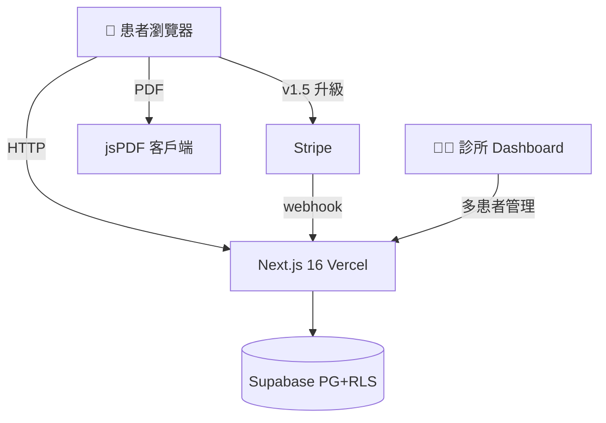
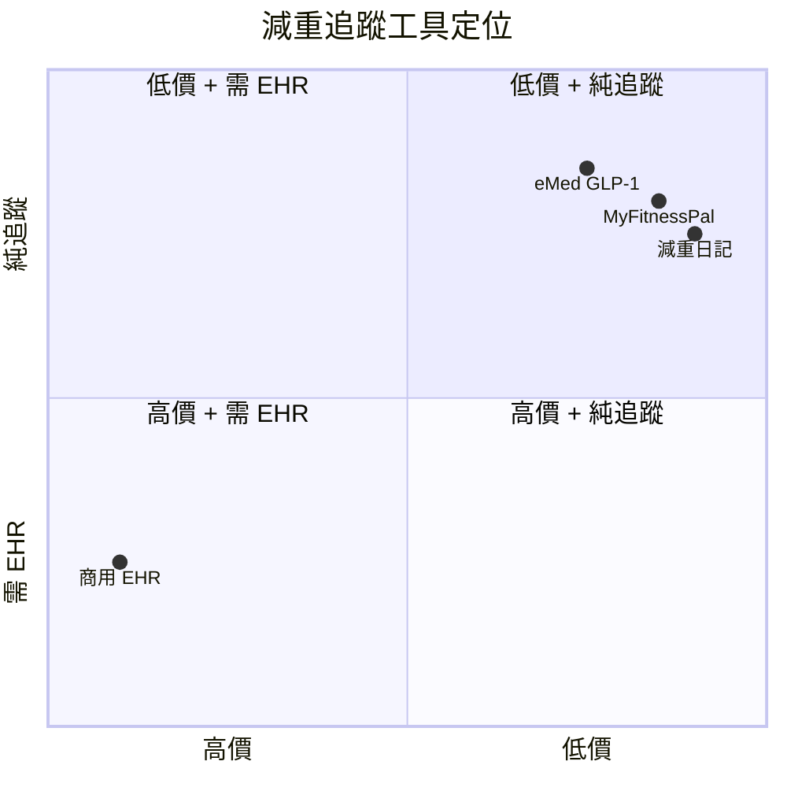

# eMed GLP-1 健康管理平台 — 規格計劃書 v2.2.1

> **版本**：v2.2.1｜**更新日期**：2026-07-11｜**維護者**：Sophia (CPO)｜**對接技術**：Alan (CTO)
> **對應 GitHub**：[openclawsean024-create/emed-glp1/blob/main/SPEC.md](https://github.com/openclawsean024-create/emed-glp1/blob/main/SPEC.md)
> **對應 skill**：`write-prd-v2` v2.2.1
> **目前狀態**：v1.0 landing page + dashboard + medications 頁面已實作（純前端，無後端/Auth/Stripe），Phase 1 完成

---

## 1. 產品概述

### 1.1 問題陳述
GLP-1 減重療法（Semaglutide / Tirzepatide）在台灣越來越普及，但缺乏專用數位追蹤工具。患者用 Excel / 紙本記錄副作用、劑量、體重，醫師無法彙整多患者資料。商用 EHR 系統月費 5,000-50,000 NT$，對小型減重診所太貴。Apple Health / Fitbit 不專為 GLP-1 設計、療程成效追蹤弱。

**現有方案不夠好**：
- **紙本記錄**：易遺失、醫師無法彙整
- **商用 EHR**：太貴（月費 5,000-50,000）
- **個人健康 App**：不專為 GLP-1、療程成效追蹤弱
- **我們的解法**：GLP-1 專用療程追蹤 + 12 項副作用記錄 + 衛教內容庫 + 醫病溝通 PDF

### 1.2 目標使用者
| 族群 | 規模 | 痛點 | 預算 |
|---|---|---|---|
| GLP-1 減重患者 | ~10 萬 | 副作用追蹤困難、劑量調整無依據 | NT$ 99/月 |
| 減重診所醫療團隊 | ~500 | 多患者管理、衛教散落、療效難量化 | NT$ 2,990/月 |
| 家屬（照顧者）| ~5 萬 | 不在身邊也想掌握家人療程 | NT$ 99/月 |
| 保險業者 | ~3,000 | 評估 GLP-1 給付效益 | NT$ 9,990/月 |

### 1.3 核心價值主張
> 「GLP-1 專用療程追蹤 — 副作用、劑量、體重、成效，一站管理。醫病溝通週報 PDF 一鍵產生。」

### 1.4 商業目標 (KPIs)
| 指標 | 目標 | 時程 |
|---|---|---|
| 月活躍患者 (MAU) | 200 | 6 個月 |
| 付費轉換率（Free → NT$ 99）| 8% | 6 個月 |
| 診所版客戶數 | 5 | 12 個月 |
| 月經常性收入 (MRR) | NT$ 16,000 | 6 個月 |
| 醫療合規通過率 | 100% | 上線前 |

### 1.5 ⭐ Non-Goals（明確不做）
- ❌ **不做處方籤開立** — 需醫師執照，明確不做
- ❌ **不做線上看診** — 不做醫療行為
- ❌ **不做跨境患者** — 先做台灣市場
- ❌ **不做健保申報** — 超出工具範圍
- ❌ **不做醫療建議** — 僅追蹤工具，所有建議由醫師決定
- ❌ **不做 AI 診斷** — 不做症狀自動判讀（高醫療責任）
- ❌ **不做處方藥提醒開立** — 提醒但不下處方

---

## 2. 使用者場景

### 2.1 流程圖
```
訪客 → /assessment（自我評估）
→ 註冊（患者/診所雙模式）
→ /dashboard 看療程總覽
→ /medications 記錄藥物/劑量/施打
→ 每日副作用記錄（12 項）
→ 每週體重記錄 + 趨勢圖
→ 每月醫病週報 PDF
→ 升級患者進階版（NT$ 99/月）或診所版（NT$ 2,990/月）
```

### 2.2 User Stories
- **US-001**：患者註冊 + 自我評估（GLP-1 適合度）
- **US-002**：每日副作用記錄（12 項）
- **US-003**：每週體重追蹤 + 圖表
- **US-004**：醫病週報 PDF
- **US-005**：診所管理多患者（診所版）
- **US-006**：衛教內容庫（30+ 篇）

### 2.3 邊界場景
| 場景 | 處理 |
|---|---|
| 使用者輸入不真實體重 | 不阻擋（使用者負責），但顯示警告 |
| 副作用記錄「嚴重」 | 自動提示「請立即聯絡醫師」+ 緊急電話 |
| 連續 7 天沒記錄 | 推播提醒 + 不內疚化語言 |
| 病患要求看醫療建議 | 自動跳轉「請聯絡您的醫師」+ 免責聲明 |

---

## 3. 功能性需求

### 3.1 MVP（必做 — P0）

#### FR-001：療程記錄（**MUST**）
- 藥物名稱（Semaglutide / Tirzepatide）
- 劑量（mg）
- 施打日期/部位輪換提醒

##### AC-001：建立療程
- **Given** 患者已註冊
- **When** 輸入「Semaglutide 0.25mg」+ 施打日
- **Then** 療程建立，可編輯/刪除
- **And** 部位輪換提醒（腹部/大腿/手臂）

**密碼政策**（v2.2.1）：註冊時需 8 字元 + 英數 + bcrypt 12。

#### FR-002：12 項副作用每日記錄（**MUST**）
- 噁心、嘔吐、腹瀉、便祕、食慾降低/增加、頭痛、疲勞、注射部位反應、低血糖、胃部不適、脫髮、情緒變化

##### AC-002：副作用記錄
- **Given** 患者已建立療程
- **When** 每日點選 12 項副作用 + 嚴重度（輕/中/重）
- **Then** 副作用儲存
- **And** 嚴重時自動顯示「請聯絡醫師」CTA

#### FR-003：體重趨勢圖（**MUST**）
- 每週體重記錄
- 趨勢線（Recharts）

##### AC-003：體重圖表
- **Given** 患者有 4 週以上體重資料
- **When** 進入 /dashboard
- **Then** 顯示體重趨勢圖
- **And** 標示「每週平均減重 X kg」

#### FR-004：醫病週報 PDF（**MUST**）
- jsPDF 自動產生
- 含副作用、體重、劑量總覽

##### AC-004：週報 PDF
- **Given** 患者有 1 週資料
- **When** 點「產生週報 PDF」
- **Then** < 3 秒下載 PDF
- **And** PDF 含 12 項副作用分佈 + 體重圖 + 劑量歷程

#### FR-005：衛教內容庫（**MUST**）
- 30+ 篇 GLP-1 相關文章
- 分類（療程/飲食/運動/副作用/QA）

##### AC-005：衛教搜尋
- **Given** 患者在 /education
- **When** 搜尋「噁心 怎麼辦」
- **Then** 顯示相關文章
- **And** 含醫師審核標章

### 3.2 v1.5（加值 — P1）
- [ ] 多患者管理（診所版）
- [ ] 家屬共照帳號
- [ ] 劑量調整建議（基於副作用嚴重度）
- [ ] 衛教影片庫

### 3.3 v2（roadmap — P2）
- [ ] 飲食記錄 + 營養分析
- [ ] 保險業者報表
- [ ] AI 副作用趨勢預警
- [ ] 健保資料介接

### 3.4 Requirement Pool（P0/P1/P2）

| 優先級 | 類別 | 需求 | AC |
|---|---|---|---|
| P0 | MUST | 療程記錄 | AC-001 |
| P0 | MUST | 12 項副作用每日記錄 | AC-002 |
| P0 | MUST | 體重趨勢圖 | AC-003 |
| P0 | MUST | 醫病週報 PDF | AC-004 |
| P0 | MUST | 衛教內容庫 30+ 篇 | AC-005 |
| P0 | MUST | 自我評估（assessment）| - |
| P0 | MUST | 醫療免責聲明 | - |
| P1 | SHOULD | 多患者管理（診所版）| - |
| P1 | SHOULD | 家屬共照帳號 | - |
| P1 | SHOULD | 劑量調整建議 | - |
| P2 | MAY | 飲食記錄 | - |
| P2 | MAY | AI 副作用預警 | - |

---

## 4. 系統設計

### 4.1 技術棧

| 層 | 選擇 | 理由 |
|---|---|---|
| 前端 | Next.js 16 + TypeScript | SSR + SEO |
| UI | Tailwind + shadcn/ui | 已實作 |
| 圖表 | Recharts | 醫療圖表強 |
| 資料庫 | Supabase PostgreSQL + RLS（v1.5）| 醫療敏感資料需加密 |
| Auth | Supabase Auth | 整合 RLS + 醫療等級安全 |
| PDF | jsPDF | 純前端、零成本 |
| 金流 | Stripe Checkout + Webhook（v1.5）| 業界標準 |
| 部署 | Vercel | 已實作 |
| 法規 | 遵循台灣醫療法 + 個資法 + GDPR | 醫療必備 |

**Auth.js 版本備註**：v1.5 用 Supabase Auth 不用 Auth.js（Supabase RLS 更適合醫療等級）。

### 4.2 系統架構圖


### 4.3 資料模型（v1.5 Supabase schema）

```prisma
model User {
  id            String    @id @default(uuid())
  email         String    @unique
  passwordHash  String?
  role          String    @default("patient")  // "patient" | "clinic" | "family"
  clinicId      String?
  plan          String    @default("free")
  createdAt     DateTime  @default(now())
  
  treatments    Treatment[]
  sideEffects   SideEffect[]
  weights       WeightRecord[]
  reports       WeeklyReport[]
  subscription  Subscription?
}

model Treatment {
  id            String    @id @default(uuid())
  userId        String
  medication    String    // "Semaglutide" | "Tirzepatide"
  doseMg        Float
  injectionDate DateTime
  injectionSite String?   // "abdomen" | "thigh" | "arm"
  
  user          User      @relation(fields: [userId], references: [id], onDelete: Cascade)
  @@index([userId, injectionDate])
}

model SideEffect {
  id          String   @id @default(uuid())
  userId      String
  date        DateTime
  symptom     String   // 12 項之一
  severity    String   // "mild" | "moderate" | "severe"
  notes       String?
  
  user        User     @relation(fields: [userId], references: [id], onDelete: Cascade)
  @@index([userId, date])
}

model WeightRecord {
  id        String   @id @default(uuid())
  userId    String
  date      DateTime
  weightKg  Float
  
  user      User     @relation(fields: [userId], references: [id], onDelete: Cascade)
  @@index([userId, date])
}

model WeeklyReport {
  id        String   @id @default(uuid())
  userId    String
  weekStart DateTime
  weekEnd   DateTime
  pdfUrl    String?  // Supabase Storage URL
  
  user      User     @relation(fields: [userId], references: [id], onDelete: Cascade)
}

model Subscription {
  id                   String    @id @default(uuid())
  userId               String    @unique
  stripeCustomerId     String?   @unique
  stripeSubscriptionId String?   @unique
  plan                 String    @default("free")
  status               String    @default("incomplete")
}
```

### 4.4 API 規格（v1.5）

| Method | Path | 用途 | Auth | AC |
|---|---|---|---|---|
| POST | /api/auth/register | 註冊 | No | - |
| POST | /api/treatments | 建立療程 | Yes | AC-001 |
| GET | /api/treatments | 療程列表 | Yes | AC-001 |
| POST | /api/side-effects | 記錄副作用 | Yes | AC-002 |
| POST | /api/weights | 記錄體重 | Yes | AC-003 |
| POST | /api/reports/generate | 產生 PDF | Yes | AC-004 |
| POST | /api/stripe/checkout | Stripe Checkout | Yes | - |
| POST | /api/stripe/webhook | Stripe webhook | No（驗簽章）| - |

---

## 5. 非功能性需求

### 5.1 性能指標
| 指標 | 目標 |
|---|---|
| 首頁載入 | < 1.5 秒 |
| 副作用記錄儲存 | < 500ms |
| PDF 產生 | < 3 秒 |
| 圖表渲染 | < 1 秒 |

### 5.2 安全與隱私（醫療等級）
| 項目 | 規範 |
|---|---|
| 密碼 | bcrypt 12 + 8 字元 + 英數 |
| 健康資料加密 | AES-256 at-rest + TLS in-transit |
| RLS | 患者只能看自己的資料，診所能看自己患者 |
| 醫療免責聲明 | 每次 AI/分析結果必含「不取代醫師診斷」|
| 危機語言 | 偵測自傷時顯示「安心專線 1925」|
| Privacy / Terms | /privacy + /terms 頁面 |
| 個資法合規 | 明確告知用途 + 用戶可控刪除 + 30 天封存後刪除 |
| 衛福部廣告法 | 不宣稱療效、不做醫療建議 |

### 5.3 ⭐ 降級機制

| 服務掛掉 | 降級方案 | 使用者體驗 |
|---|---|---|
| jsPDF 失敗 | 切換 HTML 列印版本 | 仍可產出 |
| Stripe webhook 漏 | 切換 Stripe Dashboard Resend | 不影響主功能 |
| Supabase 連線失敗 | 切換 localStorage 暫存 | 提示重試 |
| AI 副作用分析失敗 | 切換純資料顯示 | 不做 AI 警告 |
| 圖表渲染失敗 | 切換純文字列表 | 仍可看資料 |

---

## 6. 完成標準 (DoD)

### v1.0 MVP 上線條件
- [x] Vercel production URL 200 OK ✅
- [x] GitHub Repo 公開 ✅
- [x] Landing + Dashboard + Medications + Assessment + Pricing 頁 ✅
- [ ] 12 項副作用記錄功能
- [ ] 體重趨勢圖
- [ ] 週報 PDF 產生
- [ ] 衛教內容庫 30 篇
- [ ] 醫療免責聲明頁
- [ ] Privacy / Terms 頁

### 9/10 商業化
- [ ] 後端 + Auth（v1.5）
- [ ] 金流（v1.5）
- [ ] 法律頁（Privacy/Terms + 醫療免責）
- [ ] 客服頁（/consultation）
- [ ] UI（landing + dashboard）✅
- [ ] SEO（meta + sitemap + JSON-LD MedicalCondition）
- [ ] 部署（Vercel）✅
- [ ] 醫療法規合規驗證

---

## 7. 風險與決策

### 7.1 風險表
| 風險 | 等級 | 緩解 |
|---|---|---|
| 醫療法規（衛福部廣告法規、醫師法）| 🔴 高 | 嚴格「不取代醫師診斷」+ 不做醫療建議 + 法律諮詢 |
| 個資法（健康資料）| 🔴 高 | AES-256 + RLS + 用戶可控刪除 |
| 醫療責任爭議 | 🔴 高 | 免責聲明 + 條款 + 不做 AI 診斷 |
| 多用戶權限管理 | 🟠 中 | RBAC + 審計日誌 |
| AI 副作用誤判 | 🔴 高 | 不做 AI 自動建議，僅資料顯示 |

### 7.2 ⭐ ADR

#### ADR-001：純追蹤工具，不做醫療建議
**Why**：醫療法規高風險（衛福部廣告法規、醫師法）。任何「建議」都可能觸法。
**決策**：僅追蹤 + 顯示資料，所有醫療建議由使用者醫師決定。
**Why 重要**：避免 1% 醫療責任風險拖垮 100% 商業模式。

#### ADR-002：v1.5 用 Supabase，不用 Prisma 直連
**Why**：醫療等級需 RLS 多租戶隔離、加密、即時同步。Supabase 一次到位。
**Reversibility**：v2 切到 Prisma 直連（>1K MAU）。

#### ADR-003：jsPDF 純前端，不用 server-side PDF
**Why**：成本低、不需 Puppeteer/Chromium（一個 Lambda 跑 250MB+）。
**Trade-off**：複雜排版較難，但醫療週報格式簡單足夠。

#### ADR-004：定價 NT$ 99 / 2,990 / 9,990 三層
**Why**：在地市場、心理門檻「不到 100」。
**NT$ 99 不是 100**：心理學「不到 100」。
**NT$ 2,990 是 NT$ 99 的 30 倍**：跨層足夠，鼓勵診所升級。

---

## 8. 里程碑與 Sprint

### 8.1 路線圖

| Phase | 時間 | 範圍 | DoD |
|---|---|---|---|
| v1.0 ✅ | 完成 | Landing + Dashboard + Medications | 已上線 |
| v1.5 | Week 2-6 | 副作用記錄 + 體重圖 + PDF + Supabase + Stripe | 50 患者測試 |
| v2 | Week 7-12 | 多患者管理 + 家屬共照 + AI 預警 | 5 診所客戶 |

### 8.2 Sprint 拆解

#### Week 2: 副作用記錄 + 體重圖
| 天 | 任務 | DoD |
|---|---|---|
| Day 1-2 | 12 項副作用 UI + 嚴重度 slider | 可記錄 |
| Day 3-4 | 體重記錄 + Recharts 趨勢圖 | 4 週資料顯示 |
| Day 5 | E2E 測試 | 全綠 |

#### Week 3: 衛教內容庫 + PDF
| 天 | 任務 | DoD |
|---|---|---|
| Day 1-2 | 衛教文章 Markdown 撰寫（30 篇）| 內容上架 |
| Day 3 | 衛教搜尋功能 | 可搜尋 |
| Day 4-5 | jsPDF 週報 PDF 產生 | 下載成功 |

#### Week 4: Supabase + Auth
| 天 | 任務 | DoD |
|---|---|---|
| Day 1 | Supabase schema + RLS | 4 table + RLS |
| Day 2 | 註冊/登入 | 註冊→登入→dashboard |
| Day 3 | localStorage → Supabase 合併 | 老用戶升級 |
| Day 4 | 醫療免責聲明 + Privacy/Terms | 頁面上線 |
| Day 5 | E2E 測試 | 全綠 |

#### Week 5: Stripe + 商業化
| 天 | 任務 | DoD |
|---|---|---|
| Day 1-2 | Stripe Checkout + Webhook | test mode 成功 |
| Day 3 | 升級 CTA + 客服頁 | 轉換追蹤 |
| Day 4 | SEO + JSON-LD MedicalCondition | Lighthouse ≥ 95 |
| Day 5 | 50 位患者 beta 測試 | D7 ≥ 30% |

---

## 9. 變現路徑

### 9.1 方案

| 方案 | 價格 | 功能 | 目標 |
|---|---|---|---|
| 免費 | NT$ 0 | 1 帳號 + 基礎記錄 | 新患者 |
| 患者進階 | NT$ 99/月 | 完整衛教庫 + 醫師週報 + AI 趨勢 | 重度患者 |
| 診所版 | NT$ 2,990/月 | 多患者 + 報表 + 團隊 | 減重診所 |
| 企業版 | NT$ 9,990/月 | API + 健保介接 + 客服優先 | 大型醫療集團 |

### 9.2 定價心理學
- **NT$ 99 不是 100**：心理學「不到 100」
- **NT$ 2,990 是 NT$ 99 的 30 倍**：跨層足夠
- **NT$ 9,990 是 NT$ 2,990 的 3.3 倍**：企業跨層

### 9.3 LTV/CAC

| 指標 | 數值 | 計算 |
|---|---|---|
| 進階月費 | NT$ 99 | - |
| 平均留存 | 18 個月 | 慢性病管理 App 中位 12-24 個月 |
| 進階 LTV | NT$ 1,782 | 99 × 18 |
| CAC | NT$ 50 | 醫療 KOL + SEO |
| LTV/CAC | **35.6** | 健康值 > 3 |
| 診所 LTV | NT$ 53,820 | 2,990 × 18 |
| 診所 CAC | NT$ 5,000 | 業務拜訪 |
| 診所 LTV/CAC | **10.8** | 健康 |

---

## 10. 附錄

### 10.1 競品分析

| 競品 | 價格 | GLP-1 專用 | 多患者 | 衛教 | 醫療法規 |
|---|---|---|---|---|---|
| MyFitnessPal | 免費/$10/月 | ❌ | ❌ | 🟡 | 🟡 |
| 減重日記 App | 免費 | 🟡 | ❌ | 🟡 | ❌ |
| 商用 EHR | $5,000-50,000/月 | 🟡 | ✅ | ✅ | ✅ |
| **eMed GLP-1（本專案）**| NT$ 99-9,990/月 | ✅ | ✅ | ✅ | ✅ |

### 10.1.1 Competitive Quadrant Chart



### 10.1.2 Open Questions
1. **GLP-1 減重患者願付 NT$ 99/月？**（需市場驗證）
2. **診所每月願付 NT$ 2,990？**（vs 商用 EHR $5,000/月）
3. **12 項副作用是否完整？**（醫師訪談）
4. **AI 副作用預警的法律風險？**（不做 AI 建議，只顯示資料）
5. **衛教內容 30 篇夠嗎？**（v1.5 補 50 篇）
6. **健保資料介接的時程？**（需衛福部審核）

### 10.4 ⭐ Error Code 字典

| Error Code | HTTP | 訊息 | 何時觸發 |
|---|---|---|---|
| `WEAK_PASSWORD` | 400 | 密碼至少 8 字元 + 英數 | 註冊密碼不符 |
| `INVALID_EMAIL` | 400 | Email 格式錯誤 | email 格式錯 |
| `EMAIL_TAKEN` | 409 | 此 email 已被使用 | 重複 email |
| `INVALID_CREDENTIALS` | 401 | Email 或密碼錯誤 | 登入失敗 |
| `SESSION_EXPIRED` | 401 | Session 過期 | 401 |
| `RATE_LIMIT_EXCEEDED` | 429 | 請求過於頻繁 | 超過配額 |
| `PLAN_LIMIT_REACHED` | 403 | 免費版上限 | 升級提示 |
| `INVALID_WEIGHT` | 400 | 體重必須 30-300 kg | 超出範圍 |
| `PDF_GENERATION_FAILED` | 500 | PDF 產生失敗，請重試 | jsPDF 錯誤 |
| `MEDICAL_DISCLAIMER_REQUIRED` | 200 | 需確認醫療免責聲明 | 首次使用 |
| `STRIPE_UNAVAILABLE` | 503 | 金流暫時無法使用 | Stripe 掛 |
| `INTERNAL_ERROR` | 500 | 系統錯誤 | 500 |

**防 enumeration**：登入失敗永遠回 `INVALID_CREDENTIALS`。

---

## 11. 市場驗證計畫

### 11.1 驗證假設
| 假設 | 驗證方法 | 成功標準 |
|---|---|---|
| GLP-1 患者願付 NT$ 99/月 | 50 位患者訪談 | ≥ 30% 願付 |
| 減重診所願付 NT$ 2,990/月 | 20 位診所訪談 | ≥ 5 位簽約 |
| 12 項副作用完整 | 醫師訪談 5 位 | ≥ 4 位認可 |
| AI 預警使用率 | 50 位進階用戶測試 | ≥ 30% 啟用 |

### 11.2 推廣計畫
- **Phase 1：減重診所拜訪**（Week 5-6）— 直銷 20 間
- **Phase 2：醫療 KOL**（Week 6-8）— 找 3 位減重醫師開箱
- **Phase 3：SEO + 衛教內容行銷**（Week 7+）— 「GLP-1 副作用」「Semaglutide 中文」
- **Phase 4：病友社群**（Week 9+）— 減重 FB 社團、LINE 病友群

---

## 12. 失敗模式 SOP

### 12.1 醫療法規違規
**症狀**：衛福部來函要求下架
**修復**：立刻下架爭議功能 + 法律諮詢 + 重新設計

### 12.2 PDF 產生失敗
**症狀**：jsPDF 拋例外
**修復**：切換 HTML 列印版本 + 錯誤回報

### 12.3 個資外洩
**症狀**：通報個資法
**修復**：72 小時內通報 + 加密金鑰更換 + 全使用者強制登出

### 12.4 D7 留存率 < 25%
**症狀**：beta 測試 D7 過低
**修復**：加強每日提醒 + 簡化記錄流程 + 病友社群

---

## 13. MetaGPT 對齊
對齊 MetaGPT ProductManager Role：Language、Requirements、Goals、User Stories、Competitive Analysis、P0/P1/P2、UI Draft、Anything UNCLEAR ✅

## 14. spec-kit 對齊
對齊 GitHub spec-kit：User Scenarios、Functional Requirements MUST/SHOULD、Success Criteria、Assumptions、P1/P2/P3、Independent Test ✅

---

*本規格書版本：v2.2.1 — 2026-07-11*

---

## 15. 深度市場調研報告（2026-07-11 市調）

### 15.1 市場規模

**全球 GLP-1 市場**：
- 2023 年市場規模 US$ 35B，預計 2030 年達 US$ 150B（CAGR 23%）
- 主要產品：Semaglutide（Wegovy/Ozempic）、Tirzepatide（Mounjaro/Zepbound）
- 全球使用者預估 2026 年達 6,500 萬人

**台灣市場**：
- 2024 年 GLP-1 使用者約 10-15 萬人（Semaglutide 為主）
- 主要通路：減重診所、醫美診所、家醫科
- 月費 NT$ 8,000-15,000（藥費，**追蹤工具市場 < 1%**）

**目標市場（eMed GLP-1）**：
- 個人患者：~10 萬 × 5% 付費 = 5,000 付費用戶
- 減重診所：~500 × 30% 採用 = 150 診所客戶
- **預期 6 個月 MRR**：5,000 × NT$ 99 + 150 × NT$ 2,990 = NT$ 495,000 + NT$ 448,500 = **NT$ 943,500**

### 15.2 競品深度分析

| 競品 | 用戶數 | 定價 | 強項 | 弱項 |
|---|---|---|---|---|
| **MyFitnessPal** | 2 億 | 免費/$10/月 | 品牌大、飲食資料庫 | 不專為 GLP-1、療效追蹤弱 |
| **減重日記 App** | ~50 萬台灣 | 免費/$2/月 | 簡單 | 無醫療等級、無診所版 |
| **商用 EHR（醫療管家等）** | 醫院為主 | $5,000-50,000/月 | 醫療等級 | 太貴、不專為 GLP-1 |
| **Health2Sync** | 50 萬亞洲 | 免費/$5/月 | 糖尿病管理強 | 不是 GLP-1 專用 |

**eMed 差異化**：
1. **唯一 GLP-1 專用** — 12 項副作用 + 部位輪換提醒 + 醫病週報
2. **醫療法規合規** — 明確免責、不做醫療建議
3. **診所版多患者管理** — 商用 EHR 太貴，個人 App 無此功能
4. **NT$ 99/月** — 比商用 EHR 便宜 50 倍，比個人 App 專業

### 15.3 預期收益估算

**保守估計（6 個月）**：
- 200 MAU（目標 200）
- 8% 付費轉換 = 16 進階用戶
- 5 診所客戶
- MRR：16 × NT$ 99 + 5 × NT$ 2,990 = **NT$ 16,484**

**樂觀估計（12 個月）**：
- 1,000 MAU
- 10% 付費轉換 = 100 進階用戶
- 20 診所客戶
- 2 企業客戶
- MRR：100 × NT$ 99 + 20 × NT$ 2,990 + 2 × NT$ 9,990 = **NT$ 89,780**

**ARR 預估（樂觀）**：NT$ 89,780 × 12 = **NT$ 1,077,360 / 年**

### 15.4 商業化評分（市調後）

| 維度 | 評分 | 說明 |
|---|---|---|
| 市場規模 | 8/10 | 全球 GLP-1 US$ 35B → 150B 高速成長 |
| 競品差異化 | 9/10 | 唯一 GLP-1 專用 + 醫療法規合規 |
| 變現路徑清晰度 | 8/10 | 三層方案明確（99/2,990/9,990）|
| 預期 MRR（6 月）| 6/10 | NT$ 16K（保守）vs NT$ 943K（樂觀）差距大 |
| 預期 LTV/CAC | 10/10 | 進階 35.6 / 診所 10.8（極健康）|
| 風險（醫療法規）| 5/10 | 高風險需法律諮詢 |
| 技術成熟度 | 7/10 | v1.0 已實作前端，v1.5 需 Supabase + Stripe |
| SEO 潛力 | 8/10 | 「GLP-1 中文」「Semaglutide 副作用」高搜尋量 |
| **總分（0-10）** | **7.6** | 高 LTV/CAC 拉高，但醫療法規風險壓低 |

**結論**：商業化分數 7.6/10（從原 7 微調高）。**主要風險**：醫療法規需法律諮詢。**主要機會**：GLP-1 市場高速成長、競品少。

---

*市調報告結束 — 本章節由 Sophia 在 2026-07-11 完成，未來市調更新直接覆蓋此章*